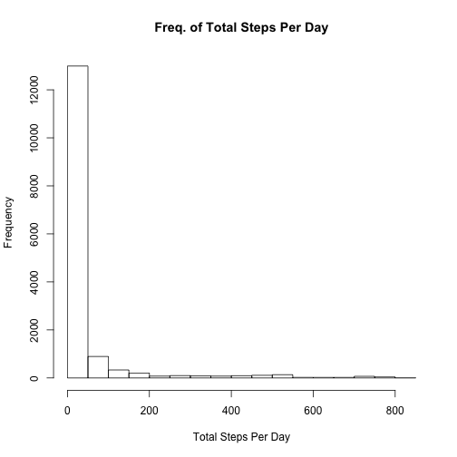
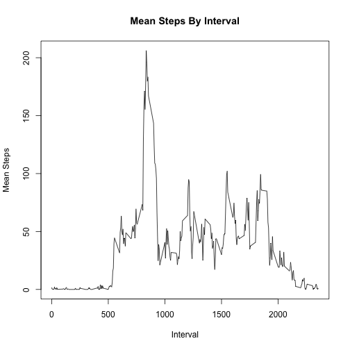
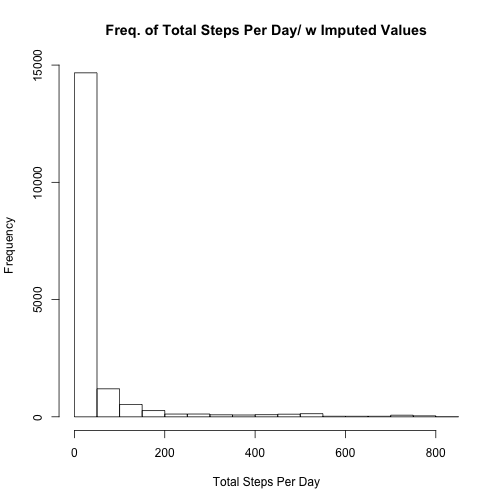
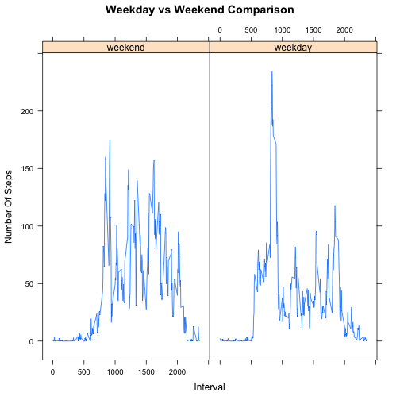

<br><br>
**Overview: **

<br>
In this document we shall examine the Activity data set. In this data set activity data is collected at 5 minute intervals during the day for the months of October and Novermber of 2012. We provide initial summary data, initial data analysis of activity patterns, graphs of such patterns. Finally we also provide some analysis of the activity patterns over Weekdays vs Weekends.

<br><br>
**Ingesting Data: **
<br>

We injest the data set from the csv file. Since we will be resuing the data in subsequent analysis we cache the data


```r
library(xtable)
activity_file <- read.csv("activity.csv")
dims <- dim(activity_file)[1]
cols <- colnames(activity_file)
range <- range(as.character(activity_file$date))
print("Dimensions");print(dims)
print("Columns");print(cols)
print("Date Range:"); print(as.character(range)); 
```

```
## [1] "Dimensions"
## [1] 17568
## [1] "Columns"
## [1] "steps"    "date"     "interval"
## [1] "Date Range:"
## [1] "2012-10-01" "2012-11-30"
```

<br><br>
**Inital Summary **
<br>

As data summaries, we provide some summary statistics and and exploratory graphs. We examine if such an exercise makes anything stand out in the basic data, before we move onto advanced statistical methods and graphs later on. At this stage we perform some initial transformations of the data to help us in providing activity summaries.


```r
library(ggplot2)   # for graphics
library(plyr,verbose=FALSE)
library(dplyr,verbose=FALSE)     # provides data manipulating functions.

summ <- summarise(activity_file,mean(steps,na.rm = TRUE))

activity_file$dayOfWeek <- as.character(weekdays(as.Date.factor(activity_file$date)))

activity_file$dayOfWeekF <- factor(activity_file$dayOfWeek,levels=c('Sunday','Monday', 'Tuesday', 'Wednesday', 'Thursday', 'Friday','Saturday'), ordered=TRUE)

activity_file$isWeekDay <- factor(activity_file$dayOfWeek %in% c('Monday', 'Tuesday', 'Wednesday', 'Thursday', 'Friday'),
                               levels=c(FALSE, TRUE), labels=c('weekend', 'weekday'))                   

af1 <- activity_file %>% group_by(dayOfWeekF) %>% summarise(SumSteps = sum(steps,na.rm = TRUE), AvgSteps = mean(steps,na.rm = TRUE), MedianSteps = median(steps,na.rm = TRUE)) 

af2 <- activity_file %>% group_by(isWeekDay)  %>% summarise(SumSteps = sum(steps,na.rm = TRUE), AvgSteps = mean(steps,na.rm = TRUE), MedianSteps = median(steps,na.rm = TRUE)) 

print(knitr::kable(summ,caption = "Average Steps - Entire Dataset"))
print(knitr::kable(af1,digits=2,caption = "Average Steps - Day of Week"))
print(knitr::kable(af2,digits=2,,caption = "Average Steps - Weekend vs. Weekday"))
hist(activity_file$steps,xlab="Total Steps Per Day",main="Freq. of Total Steps Per Day")
```

 

```
## 
## 
## | mean(steps, na.rm = TRUE)|
## |-------------------------:|
## |                   37.3826|
## 
## 
## | SumSteps| AvgSteps| MedianSteps|
## |--------:|--------:|-----------:|
## |   570608|    37.38|           0|
## 
## 
## | SumSteps| AvgSteps| MedianSteps|
## |--------:|--------:|-----------:|
## |   570608|    37.38|           0|
```

<br><br>
**Average Daily Acivity Pattern **
<br>

In this section compute and plot the averge daily steps per 5 minute interval across all days. We also determine which 5 minute interval contains the maximum number of steps.


```r
library(ggplot2)   # for graphics
library(plyr,verbose=FALSE)
library(dplyr,verbose=FALSE)     # provides data manipulating functions.

#i.e mean steps per day per 5 min interval
datac <- ddply(.data = activity_file,.variables =c("interval"),
               .fun = function(xx) {
                 c(TotalSteps= sum(xx$steps, na.rm=TRUE),
                   MeanSteps= mean(xx$steps, na.rm=TRUE) 
                 ) 
               }
          )

#Which 5-minute interval, on average across all the days in the dataset, contains the maximum number of steps?
max_steps <- datac[max(datac$TotalSteps)==datac$TotalSteps,]


plot(y=datac$MeanSteps,x=datac$interval,type = "l",xlab="Interval",ylab="Mean Steps",main="Mean Steps By Interval")
```

 

```r
print(knitr::kable(max_steps,caption = "Interval with Max Steps"))
```

```
## 
## 
## |    | interval| TotalSteps| MeanSteps|
## |:---|--------:|----------:|---------:|
## |104 |      835|      10927|  206.1698|
```

<br><br>
**Imputing Missing Values **
<br>

We first compute the total number of missing values. Our strategy for imputing missing values is to replace such with the average of value for that interval by day of the week. We choose this strategy because it appears from our initial analysis that activity by interval combinded with day of week is a significant differentiating factor.

From the results displayed in the histogram below it appears that the result of such an imputing strategy has been that the inactivity of 0-steps becomes more pronounced. Because the data has many days of the Week with fewer steps.


```r
library(ggplot2)   # for graphics
library(plyr,verbose=FALSE)
library(dplyr,verbose=FALSE)     # provides data manipulating functions.
library(lattice)

activity_file$dayOfWeek <- as.factor(weekdays(as.Date.factor(activity_file$date)))

weekdays1 <- c('Monday', 'Tuesday', 'Wednesday', 'Thursday', 'Friday')
activity_file$isWeekDay <- factor(activity_file$dayOfWeek %in% weekdays1, 
                               levels=c(FALSE, TRUE), labels=c('weekend', 'weekday'))                   

# Create Lookup Table
data_dayOfWeek <- ddply(.data = activity_file,.variables =c("interval","dayOfWeek"),
               .fun = function(xx) {
                 c(TotalSteps= sum(xx$steps, na.rm=TRUE),
                   MeanSteps= mean(xx$steps, na.rm=TRUE)
                 ) 
               }
)


# join by interval and weekday + MeanSteps
merged_activity <- merge(x = activity_file, y = data_dayOfWeek, by = c("interval","dayOfWeek"), all = TRUE)

# 3. Create a new dataset that is equal to the original dataset but with the missing data filled in.
sorted_activity <- merged_activity[order(merged_activity$date, merged_activity$interval),] 
sorted_activity$new_steps <- ifelse (is.na(sorted_activity$steps) == TRUE ,as.integer(sorted_activity$MeanSteps), sorted_activity$steps)

#4. Make a histogram of the total number of steps taken each day and Calculate and report the mean and median 
# total number of steps taken per day. Do these values differ from the estimates from the first part of the assignment? 
summarise(sorted_activity,mean(steps,na.rm=TRUE),median(steps,na.rm = TRUE),mean(new_steps),median(new_steps))

# compute results by weekday/weekend
data_WeekDayInterval <- ddply(.data = sorted_activity,.variables =c("isWeekDay","interval"),
                             .fun = function(xx) {
                               c(TotalSteps= sum(xx$steps, na.rm=TRUE),
                                 MeanSteps= mean(xx$steps, na.rm=TRUE)
                               ) 
                             }
)

# Count of missing values
mv <- sapply(activity_file, function(x) sum(is.na(x)))

print(knitr::kable(mv,caption = "Rows with Missing Values"))
```

```
## Error in kable_markdown(x = structure(c("steps", "date", "interval", "dayOfWeek", : the table must have a header (column names)
```

```r
# Histogram of the imputed values
hist(sorted_activity$new_steps,xlab="Total Steps Per Day",main="Freq. of Total Steps Per Day/ w Imputed Values")
```

 

```r
# XYPlot 
xyplot(MeanSteps ~ interval | isWeekDay, data = data_WeekDayInterval,type="l",xlab="Interval",ylab="Number Of Steps",main="Weekday vs Weekend Comparison")
```

 

```
##   mean(steps, na.rm = TRUE) median(steps, na.rm = TRUE) mean(new_steps)
## 1                   37.3826                           0        37.53398
##   median(new_steps)
## 1                 0
```


<br><br>
**Weekdays vs Weekends **
<br>

There are different activity levels between weekdays and weekends. The above plot shows that activity during the week is more spread out, while during the weekend it spikes at certain intervals.

